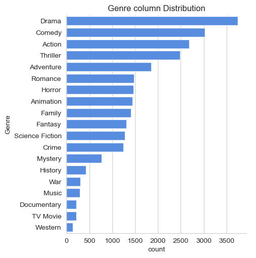
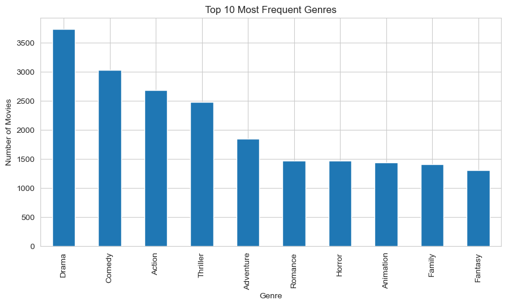
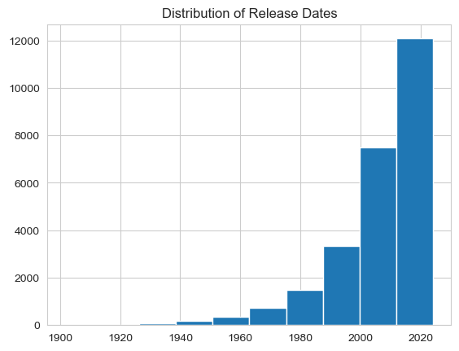
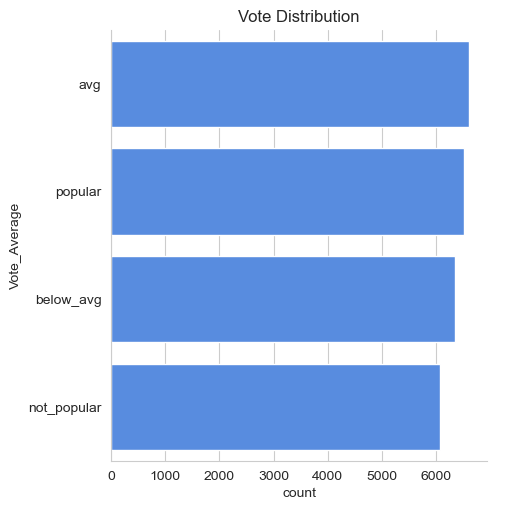

# Netflix Movie Data Analysis 🎬📊

## 📌 Project Overview
Netflix leverages data science to understand audience preferences and optimize content strategy.
This project analyzes a Netflix movie dataset to extract meaningful insights related to genres,
popularity, voting behavior, and release trends.

## 📂 Dataset
- Source: Netflix movie dataset
- Records: 9,000+ movies
- Key Features:
  - Title
  - Genre
  - Popularity
  - Vote_Count
  - Release_Date

## 🛠️ Tools & Technologies
- Python
- Pandas
- NumPy
- Matplotlib
- Seaborn
- Jupyter Notebook

## 📊 Business Questions Answered
1. What is the most frequent genre of movies on Netflix?
2. Which genre has the highest total votes?
3. Which movie has the highest popularity and what is its genre?
4. Which movie has the lowest popularity and what is its genre?
5. Which year has the highest number of movie releases?

## 🔍 Key Insights

1. **Drama** is the most frequent genre on Netflix, indicating a strong focus on storytelling-driven content.
2. **Drama** also has the highest total number of votes among all genres, reflecting high audience engagement and viewer participation.
3. The movie with the **highest popularity** is **Spider-Man: No Way Home**, with a popularity score of **5083.954**, and it belongs primarily to the **Action** genre.
4. The movie with the **lowest popularity** is **The United States vs. Billie Holiday**, with a popularity score of **13.354**, and it falls under the **Music** genre.
5. The year **2020** recorded the highest number of movie releases on Netflix, highlighting a significant expansion in content production during that period.

## 📊 Visualizations

### 🎭 Genre Distribution



### 📅 Movies Released Per Year

.png)

### 🗳️ Vote Distribution



## ▶️ How to Run This Project
1. Clone the repository:
   ```bash
   git clone https://github.com/your-username/Netflix-Movie-Data-Analysis.git
